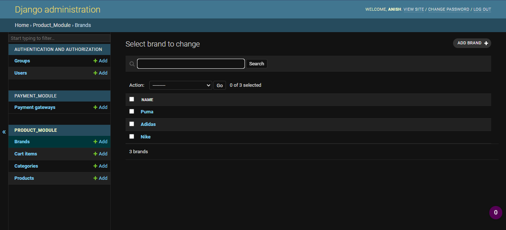
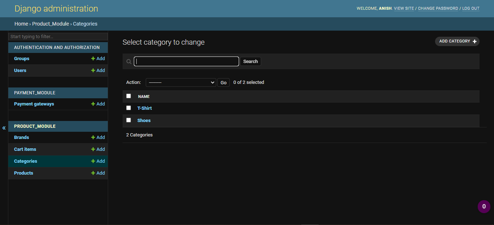
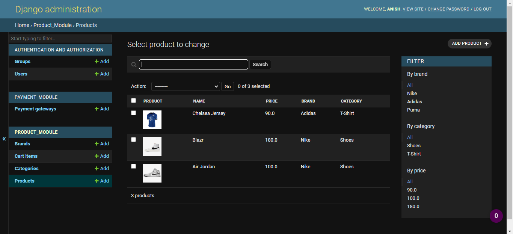

# Lab Report 2

## Objectives

* To create Brand, Category, and Product models in the product module and applying those changes in the database
* To add superuser for admin interface
* To enable CRUD operation for the corresponding model in admin site

***

## Introduction

A model is the single, definitive source of information about your data. It contains the essential fields and behaviors of the data you’re storing. Generally, each model maps to a single database table.

The basics:

* Each model is a Python class that subclasses django.db.models.Model.
* Each attribute of the model represents a database field.
* With all of this, Django gives you an automatically-generated database-access API.

Migrations are Django’s way of propagating changes you make to your models (adding a field, deleting a model, etc.) into your database schema. They’re designed to be mostly automatic, but you’ll need to know when to make migrations, when to run them, and the common problems you might run into.

There are several commands which you will use to interact with migrations and Django’s handling of database schema:

* **makemigrations**, which is responsible for creating new migrations based on the changes you have made to your models.
* **migrate**, which is responsible for applying and unapplying migrations.

Migrations can be thought as a version control system for your database schema. **makemigrations** is responsible for packaging up your model changes into individual migration files - analogous to commits - and **migrate** is responsible for applying those to your database.

***

## Procedure

1. In the product_module module, open “models.py” and edit code for Brand model

        class Brand(models.Model):
            name = models.CharField(max_length=200)
            is_active = models.BooleanField()

2. In the product_module module, open “models.py” and edit code for Category 
model

        class Category(models.Model):
            name = models.CharField(max_length=200)
            is_active = models.BooleanField()

            class Meta:
                verbose_name_plural = "Categories"

3. In the product_module module, open “models.py” and edit code for Product model.

        class Product(models.Model):
            name = models.CharField(max_length=200)
            price = models.FloatField()
            quantity = models.IntegerField()
            image_url = models.CharField(max_length=500)
            color_code = models.CharField(max_length=20)
            brand = models.ForeignKey(Brand, on_delete=models.CASCADE)
            category = models.ForeignKey(Category, on_delete=models.CASCADE)
            registered_on = models.DateTimeField()
            is_active = models.BooleanField()

4. Configure database for sqlite3

        DATABASES = {
            'default': {
                'ENGINE': 'django.db.backends.sqlite3',
                'NAME': BASE_DIR / 'db.sqlite3',
            }
        }

5. Models have changed. Run migration commands to persist the changes to db.

        python manage.py makemigrations
        python manage.py migrate

6. Create a superuser for admin interface

        python manage.py createsuperuser

7. To enable the admin interface, go to “admin.py” and add the following code. This 
enabled the CRUD operation for the corresponding model in admin site.

        from .models import Brand, Category, Product

        admin.site.register(Brand)
        admin.site.register(Category)
        admin.site.register(Product)

8. Run the project/server and verify CRUD operation for brand, category, product

        python manage.py runserver

9. Go to browser and navigate your project url.

***

## Output

***

## Conclusion

In this lab session, we learned to create to create a model, edit the model in an appropriate manner, and enter and evaluate the entered data in the django server database.
