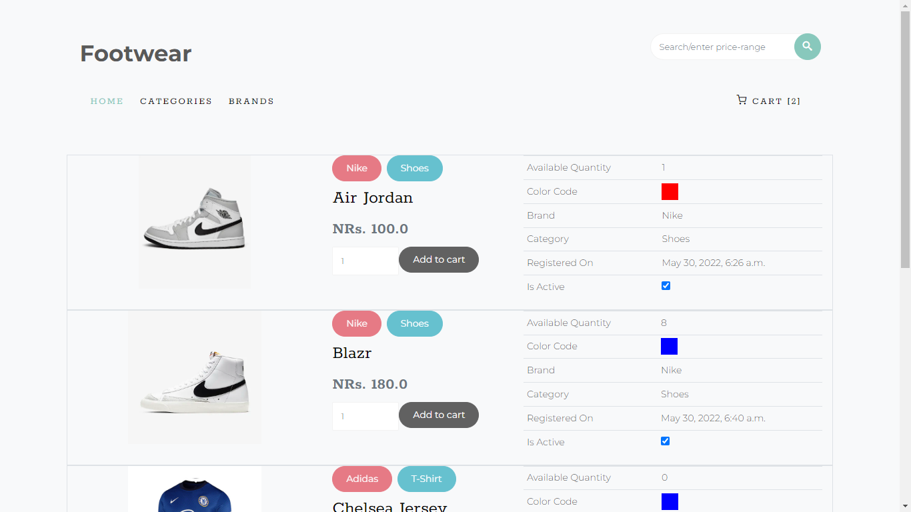
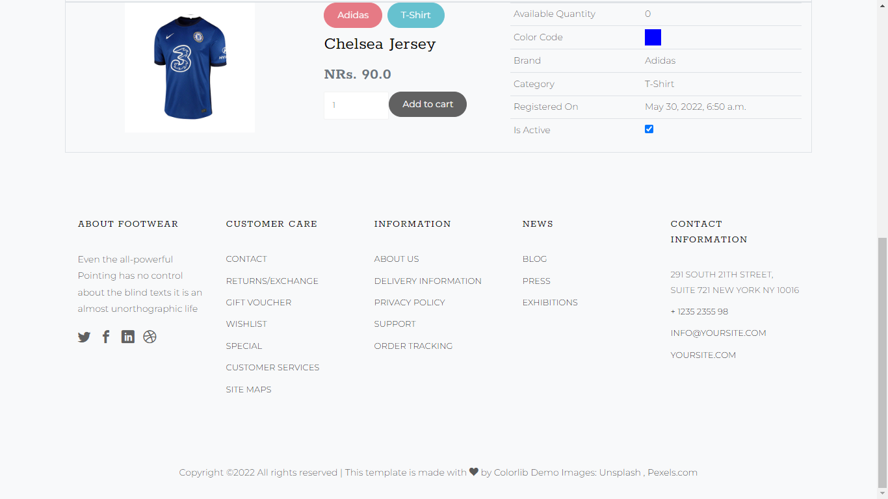

# Lab Report 4

## Objectives

* To set up basic template to display products, categories, and brands
* To configure proper settings to connect the model to the view, and view to the template
* To add searching capability in the user page for products, categories, and brands

***

## Introduction

Being a web framework, Django needs a convenient way to generate HTML dynamically. The most common approach relies on templates. A template contains the static parts of the desired HTML output as well as some special syntax describing how dynamic content will be inserted.

For our current project, we will create a single template directory that will be spread over the entire project for simplicity. App-level templates are generally used in big projects or in case we want to provide a different layout to each component of our webpage.

***

## Procedure

1. Before implementing search UI, first prepare template for Django. Create a directory “templates” and add a base html template file “base.html”.

2. To ensure that the “templates/base.html” is available globally, adjust the TEMPLATES/DIRS setting. Go to “settings.py” and make the following adjustment.

        ...
        TEMPLATES = [
            {
            'BACKEND': 'django.template.backends.django.DjangoTemplates',
            'DIRS': [BASE_DIR / 'templates'],
        ...

3. Inside “product_module”, create a directory “templates”. Note that this “templates” folder is different from step #1. Create a html “index.html”.

4. From the project “product_module” open “views.py” and add the code as below for search operation (GET and POST).

        from django.db.models import Q
        from .models import Product, Brand, Category
        ...
        def index(request):
            if request.method == "GET":
                category_id = request.GET.get("category")
                brand_id = request.GET.get("brand")
                if category_id:
                    filter_query = Q(category__id=category_id)
                    products = Product.objects.filter(filter_query)
                elif brand_id:
                    filter_query = Q(brand__id=brand_id)
                    products = Product.objects.filter(filter_query)
                else:
                    products = Product.objects.all()
                
                categories = Category.objects.all()
                brands = Brand.objects.all()
                context = {
                        'products': products,
                        'categories': categories,
                        'brands': brands,
                        'search_query': '',
                    }
                return render(request, 'index.html', context)
            elif request.method == "POST":
                q = request.POST.get("query")
                if "-" in q:
                    price_values = q.split("-")
                    filter_query = Q(price__gte=price_values[0]) & Q(price__lte=price_values[1])
                else:
                    filter_query = Q(name__icontains=q) | Q(price__icontains=q) |  Q(brand__name__icontains=q)
                products = Product.objects.filter(filter_query)
                categories = Category.objects.all()
                brands = Brand.objects.all()
                context = {
                        'products': products,
                        'categories': categories,
                        'brands': brands,
                        'search_query': q,
                    }
                return render(request, 'index.html', context)

5. In “product_module” create a file for “urls.py” and add the URL routing config.

        from django.urls import path

        from .views import index

        urlpatterns = [
            path('', index),
        ]

6. In “ecommerce_yourname > urls.py”, include “product_module.urls”

        from django.contrib import admin
        from django.urls import path, include

        urlpatterns = [
            path('admin/', admin.site.urls),
            path('', include('product_module.urls')),
        ]

7. Run the project and navigate to admin to check the result.

        python manage.py runserver

***

## Output

***

## Conclusion

In this lab session, we learned how to add template in our project that will used over multiples pages for simplicity. We added necessary configurations to make the template work by connecting template with view and model.