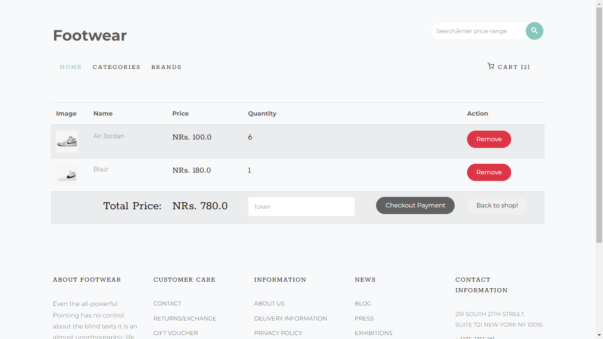

# Lab Report 6

## Objectives

* To prepare a module for cart.
* To add and remove items from cart dynamically.

***

## Introduction

A shopping cart is an essential part of a retailer's online store that streamlines the online shopping experience. It's software that allows website visitors to select, reserve, and purchase a product or service from an eCommerce interface. A shopping cart is a piece of software that keeps the record of the items a buyer has 'picked up' from the online store.

***

## Procedure

1. In model.py add the code for cart-item model:

        ...
        from django.contrib.auth.models import User
        ...
        class CartItem(models.Model):
            user = models.ForeignKey(User , on_delete=models.CASCADE)
            product = models.ForeignKey(Product, on_delete=models.CASCADE)
            quantity = models.IntegerField()
            entered_on = models.DateTimeField()

2. Ensure the database table for the added model is created properly.

        python manage.py makemigrations product_module
        python manage.py migrate product_module

3. In admin.py add the following code:

        from .models import CartItem
        admin.site.register(CartItem)

4. In views.py add the view for "cart":

        ...
        from django.shortcuts import render, redirect
        from django.contrib.auth.decorators import login_required
        from datetime import datetime
        from .models import Product, CartItem
        ...
        @login_required(login_url="/admin/login")
        def cart(request):
            # get request data
            product_id = request.GET.get("id")
            quantity = request.GET.get("qty")

            if product_id:
                # retrieve product data
                product = Product.objects.get(id=product_id)

                try:
                    # get cart item and increase quantity
                    cart_item = CartItem.objects.get(user=request.user, product=product)
                    cart_item.quantity += int(quantity)
                    cart_item.entered_on = datetime.now()
                except CartItem.DoesNotExist:
                    # initialize cart item
                    cart_item = CartItem(
                    user=request.user,
                    product=product,
                    quantity=int(quantity),
                    entered_on = datetime.now(),
                    )
                # save to database
                cart_item.save()

            # retrieve the cart items for the user from db
            cart_items = CartItem.objects.filter(user=request.user)

            # calculate total
            total = 0
            for item in cart_items:
                total += item.product.price * item.quantity

            # return view
            context = {
                'cart_items': cart_items,
                'total': total,
            }
            return render(request, "cart.html", context)

        def removecart(request, id):
            try:
                # get cart item and remove it
                product = Product.objects.get(id=id)
                cart_item = CartItem.objects.get(user=request.user, product=product)
                cart_item.delete()
            except CartItem.DoesNotExist:
                pass

            # redirect to cart
            return redirect(cart)

5. In templates crete a file named cart.html and enter the following code:

        
         Cart 
         Your Cart 
        
        
            

                <h4 class="col-sm-12 col-md-12 col-lg-12">
                    <i class="fa fa-shopping-cart" aria-hidden="true"></i> Your cart
                    {{cart_items|length}}
                </h4>
            

            <table class="table table-striped">
                <thead>
                <tr>
                    <th>Image</th>
                    <th>Name</th>
                    <th>Price</th>
                    <th>Quantity</th>
                    </tr>
                </thead>
                <tbody>
                
                    <tr>
                        <td></td>
                        <td>{{ item.product.name }}</td>
                        <td><h5>NRs. {{ item.product.price }}</h5></td>
                        <td><h5>{{ item.quantity }}</h5></td>
                        <td>
                            <form method="post"action="/cart/remove/{{item.product.id}}">
                            
                            <button type="submit" class="btn btn-danger"
                            type="submit"><i class="fa fa-times" aria-hidden="true"></i> Remove</button>
                            </form>
                        </td>
                    </tr>
                
                <tr>
                    <td></td>
                    <td style="text-align: right;"><h3>Total Price:</h3></td>
                    <td><h3>NRs. {{ total }}</h3></td>
                    <td>
                        <form method="post" action="/payment/checkout/">
                        
                            

                                <input type="text" class="form-control" name="token"placeholder="Token" />
                                <input type="hidden" name="amount" value="{{ total}}" />
                                <button type="submit" class="btn btn-primary type="submit"><i class="fa fa-shopping-cart" aria-hidden="true"></i>Checkout Payment</button>
                            

                        </form>
                    </td>
                    <td>
                        <button onclick="location.href='/';" class="btn btn -info"><i class="fa fa-search" aria-hidden="true"></i> Back to shop!</button>
                    </td>
                </tr>
                </tbody>
            </table>
            

                <h2>No product added to cart.</h2>

                <button onclick="location.href='/';" class="btn btn-info"><i
                class="fa fa-search" aria-hidden="true"></i> Back to shop!</button>

            
        

6. In urls.py add the following:

        from django.urls import path

        from .views import search, cart, removecart

        urlpatterns = [
            path('', search),
            path('cart/', cart),
            path('cart/remove/<int:id>', removecart),
        ]

7. Run the server and check the result.

        python manage.py runserver

***

## Output

***

## Conclusion

Here from this lab session we got to know how to add an item from the product template to cart template dynamically and remove them accordingly.