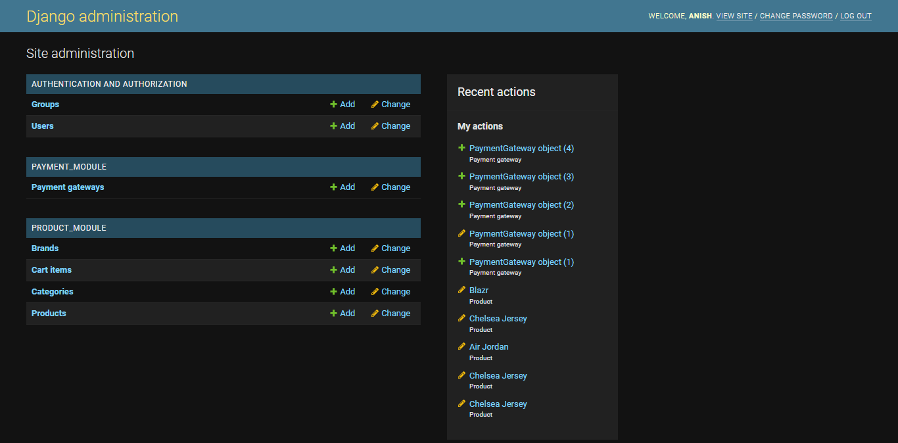
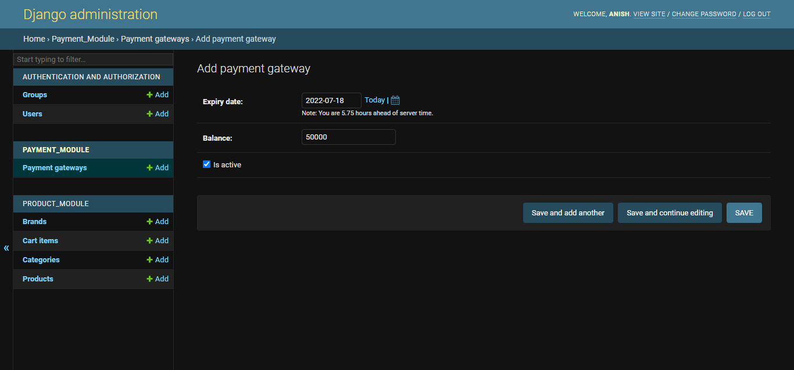

# Lab Report 4

## Objectives

* To add a secured payment gateway.
* Perform the basic concept of online payment.

***

## Introduction

Payment Gateway is an online payment processing technology which helps businesses to accept credit cards and electronic checks.In other words, payment gateways are “Manin-the-middle” which are located between e-commerce platforms and clients. A payment gateway allows a firm to −

1. Make and take payments quickly and easily.
2. Keep customer's data (information) and money secure.
3. Gain trust of customers, so they are willing to hand over their money.

***

## Procedure

1. Start by adding a payment_module

        python manage.py startapp payment_module

2. Add the installed module to the 'INSTALLED_APPS' list in setting.py

        INSTALLED_APPS = [ ..., 
            'payment_module' ]

3. In 'models.py' in payment_module, add the code for 'paymentgateway':

        import uuid

        class PaymentGateway(models.Model):
            token = models.UUIDField(default= uuid.uuid4,editable=False)
            expiry_date = models.DateField()
            balance = models.FloatField()
            is_active = models.BooleanField()

4. Migrate the changes to the database:

        python manage.py makemigrations payment_module
        python manage.py migrate payment_module 

5. Add the following code to 'admin.py':

        from .models import PaymentGateway

        class PaymentGatewayAdmin(admin.ModelAdmin):
            list_display = ["token", "balance", "expiry_date", "is_active",]

            class Meta:
                model = PaymentGateway

        admin.site.register(PaymentGateway, PaymentGatewayAdmin)

6. Run the server and generate the token.

***

## Output

***

## Conclusion

From this lab session, we came to know about how the online token is acutally generated and how the payment gateway works in the backend.